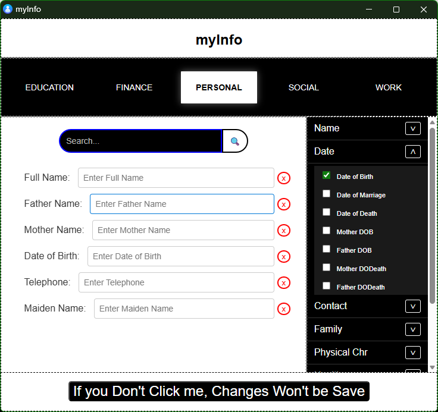
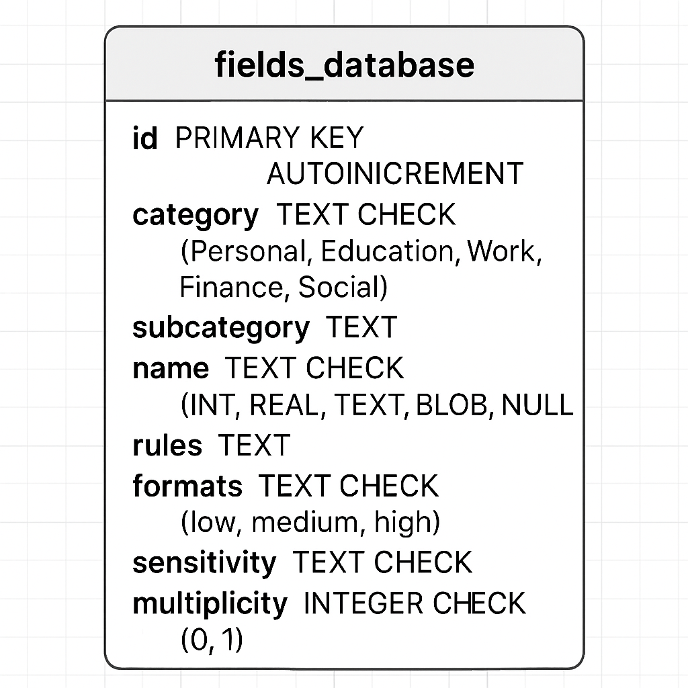
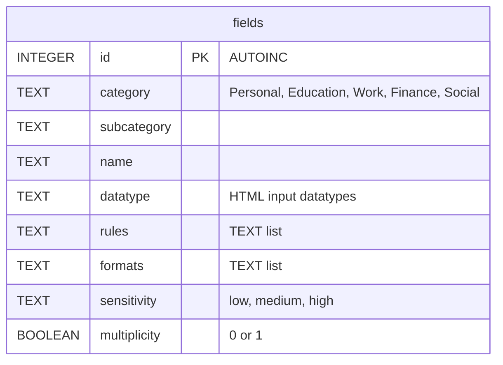
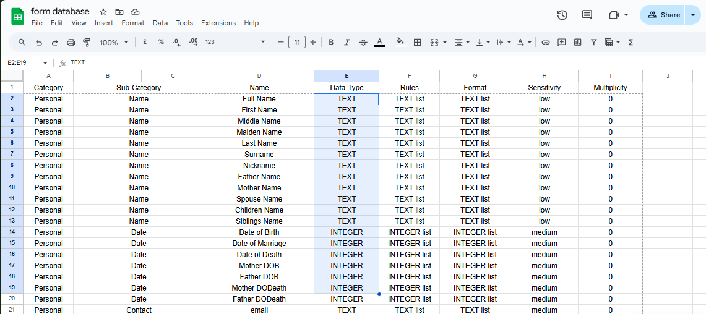

# 🤖 myInfo App

## 📜 Description

Have you ever been filling out a college application, an online form, or making a new account and found yourself typing or copy-pasting the same info over and over? Or maybe you've wondered:

> **What if there was an easy way of doing this without Google or your browser keeping track of your information?** 🤔 *What if I wrote only one document with all my information, had a unique copy-paste button for each field, and never had to select, copy, or worry about what Big Tech is doing with my data?* 🔒

Well, this simple application, **myInfo**, is here to make your life easier. The concept is straightforward: an executable file (`.exe`) opens up a very simple and intuitive GUI  where you can **one time** fill in all your details—from your school start date to your social media handles. After that, you can **generate a simple HTML page** with a dedicated copy button for every piece of data and a handy search bar.

The application itself works **completely offline** and does not use any APIs, connection functions, or network protocols. `Still, Caution is Advised.`

---

## 🚀 How to Install and Use

### 📥 Install

The executable file for Windows can be installed from here: [[**Download myInfo.exe **](https://github.com/def-fun7/myInfo/tree/main/dist)]

### 💻 Usage

After installation, just open the app and start typing!

The default fields are (so far):

* **Full Name** 👤
* **Mother Name**
* **Father Name**
* **Cell Phone** 📱
* **Telephone** ☎️
* **School Name** 🏫
* **University Name** 🎓

You can add more fields by searching in the search bar or expanding the menu on the right side and checking the appropriate boxes.

Once you are done, click the big black button at the bottom or press CTRL + ENTER to save Like:

For things like emails or phone numbers, you can do this:

and the generated document page, which is saved on your desktop, can be used as:

---

## 🏗️ Structure

The application is built using **Eel** and **SQLite**. The front end uses HTML, JavaScript (jQuery), and CSS.

### Database Schema

The SQLite database schema is defined as follows:

A more detailed layout of the `fields` table includes:

I used Google Sheets 📑 to fill this table, which is still a work in progress. If you want to help, feel free to add some new fields here: [[**Google Sheets Link**](https://docs.google.com/spreadsheets/d/1K1De6CBlEXe-S3qB3ywr3TqQpyRtdJW_UV7eubHpCXw/edit?gid=0#gid=0)]

For my workflow, I then used `gspread` to automatically pull the sheet data from my Google Drive and initialize the database. This database doesn't automatically update when the Google Sheet changes, for simplicity and **security reasons** (I want the app to work completely offline).

However, The executable includes a db file in itself so unless you want to customise or add some field of your own, it is gonna work for you. And if you do wanna customise, a simple function is provided! You can download the Google Sheet from here and edit it for yourself, then use the function to create a new database if you like.

The application then uses this database via Python to send data to the front end to render:

* Categories in the navigation bar.
* Subcategories in the right-side menu.
* Default fields on the form.

As you fill the form and save it, the app creates a new **JSON file** on your system to securely store your information and later use it to build the HTML copy page.

*For suggestions or comments, feel free to let me know.*

---

## 🎯 Next Steps

* 🔐 Encrypting the JSON file on the system.
* 📚 Update the database and fill it more in the other three categories (Work, Finance, Social).
* 🧪 Test, clean, and documentation.

---

## 🙋 About Me

I am def\_fun!
